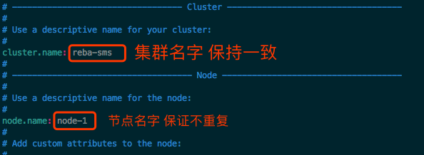
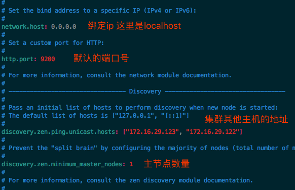
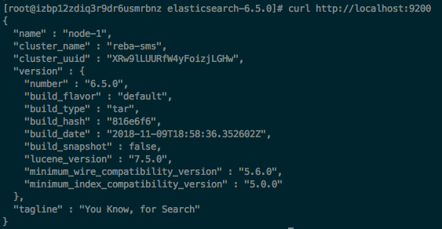

## 安装与配置
这里准备了两台服务器(centos7.4) 安装java环境

去官网下载最新版的elasticsearch-6.5.0 
解压并配置文件 两台服务器都要配置


<!-- more -->


因为elastic不允许root用户直接启动,这里要新建用户

	groupadd elastic
	useradd elastic -g elastic -p elastic
	chown -R elastic:elastic .

使用`su elastic`切换用户后 直接使用`./bin/elasticsearch`来启动 
后台启动的话加`-d`参数
启动后通过`curl`命令来检查是否成功:



看到以上字样代表es已经启动成功了 这里可以就加个nginx提供对外访问了

## 数据同步
### 从mysql同步到es
我是要从mysql中增量同步数据到es 这里选择logstash来完成
logstash也被收入elastic了 所以直接去官网下载和es相同版本的logstash解压即可
解压后安装插件

	./bin/logstash-plugin logstash-input-jdbc
	./bin/logstash-plugin logstash-output-elasticsearch
	
之后要下载mysql的连接库 mysql-connector-java-8.0.13.jar 放在config目录备用
接下来新建配置文件logstash.conf

```
input {
  jdbc {
    # mysql相关jdbc配置
    jdbc_connection_string => "jdbc:mysql://rm-bp1t5v2***.mysql.rds.aliyuncs.com:3306/reba_sms?useUnicode=true&characterEncoding=utf-8&useSSL=false"
    jdbc_user => "***"
    jdbc_password => "***"

    # jdbc连接mysql驱动
    jdbc_driver_library => "./mysql-connector-java-8.0.13.jar"
    jdbc_driver_class => "com.mysql.jdbc.Driver"
    jdbc_paging_enabled => true
    jdbc_page_size => "50000"

    jdbc_default_timezone =>"Asia/Shanghai"

    # mysql文件, 也可以直接写SQL语句
    statement_filepath => "send_detail.sql"

    # 这里类似crontab,可以定制定时操作，比如每分钟执行一次同步(分 时 天 月 年)
    schedule => "*/1 * * * * *"

    # 是否需要记录某个column 的值,如果record_last_run为真,可以自定义我们需要 track 的 column 名称，此时该参数就要为 true. 否则默认 track 的是 timestamp 的值.
    use_column_value => true

    # 如果 use_column_value 为真,需配置此参数. track 的数据库 column 名,该 column 必须是递增的. 一般是mysql主键
    tracking_column => "updateTime"

    #tracking_column_type => "numeric"

    last_run_metadata_path => "./logstash_capital_bill_last_id"

    # 是否清除 last_run_metadata_path 的记录,如果为真那么每次都相当于从头开始查询所有的数据库记录
    clean_run => false

    #是否将 字段(column) 名称转小写
    lowercase_column_names => false
  }
}

output {
  elasticsearch {
  	 #es主机配置
    hosts => "localhost:9200"
    #索引名
    index => "send_detail"
    #生成文档的主键
    document_id => "%{id}"
	 #数据格式模板
    template=>"/data/elastic/logstash-6.5.1/config/template_sendDetail.json"
    template_overwrite => true
  }
}
```

在这里是用修改时间来更新数据 updateTime字段类型是long时间戳 以上配置可以正常使用

在config目录下启动:

	../bin/logstash -f logstash.conf

实际使用中可以切分日志:

	  nohup  ../bin/logstash -f logstash.conf 2>&1 \
	    | nohup cronolog ./logs/nohup_%Y%m%d.log >> nohup.out 2>&1 &
	   
### 数据格式问题

这里有个问题是logstash自己判断了类型插入elastic 
但其实不是我们想要的类型 比如把我值为0,1的状态自动转为boolean类型
这里就要指定模板,编辑模板template_sendDetail.json:

```
{
  "template": "*",
  "settings": {
    "index.refresh_interval" : "5s"
  },
  "mappings": {
    "_default_": {
      "dynamic_templates" : [
        {
          "message_field" : {
            "path_match" : "message",
            "match_mapping_type" : "string",
            "mapping" : {
              "type" : "text",
              "norms" : false
            }
          }
        },
        {
          "string_fields" : {
            "match" : "*",
            "match_mapping_type" : "string",
            "mapping" : {
              "type" : "text",
              "norms" : false,
              "fields" : {
                "keyword" : {
                  "type" : "keyword",
                  "ignore_above" : 256
                }
              }
            }
          }
        }
      ],
      "properties": {
          "@timestamp" : {
            "type" : "date"
          },
          "@version" : {
            "type" : "keyword"
          },
          "id" : {
            "type" : "long"
          },
          "content" : {
            "type" : "text",
            "fields" : {
              "keyword" : {
                "type" : "keyword",
                "ignore_above" : 256
              }
            }
          },
          "status" : {
            "type" : "integer"
          },
          "user" : {
            "type" : "long"
          },
          ......
      }
    }
  }
}
```
然后照logstash.conf中的配置即可使用

### 安装kibana
同样是官网下载 必备组件 安装简单 不再细说

## 数据查询
这里为了方便没有使用java api 直接走http查询数据 需要自己拼装json
看起来麻烦一些 但是上手速度快 查询比较自由
es的查询,聚合都非常强大 回头另起一篇来写

### 分页问题
对于数据量小的查询我们可以直接舍弃前面的结果来做出分页效果
但是对于大数据量的查询,这么做的效果不好
现在新版es提供了一个游标功能search_after 
记住这次查询的最后一条结果 就可以快速的查询出下一页的数据
缺点是页面上不能提供跳页功能 只能上一页或下一页


